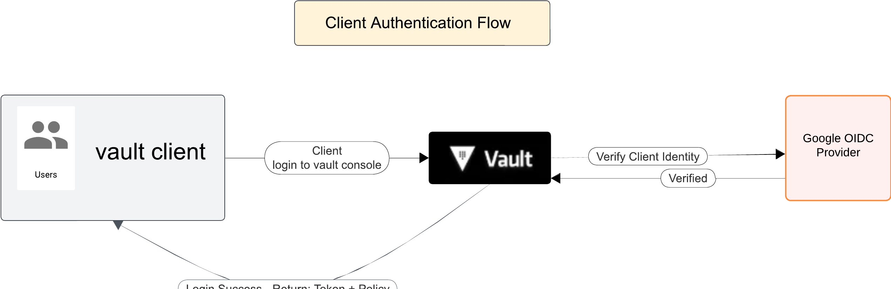
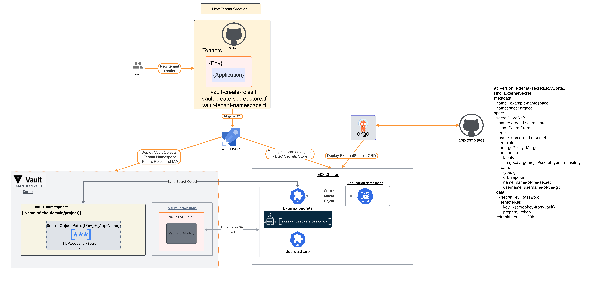
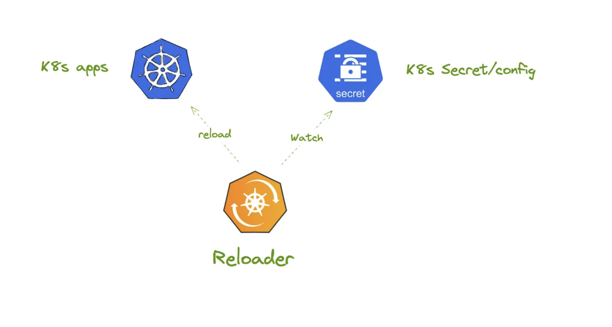
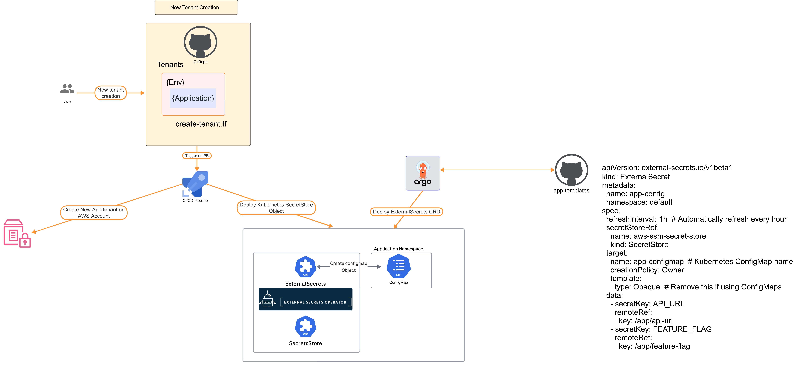

# Architecture Decision Record: Centralized Config Management

[](https://shields.io/)


# Table of contents  
- [Problem Context](#Context)  
- [Solutions Considered](###SolutionsConsidered)    
- [Solution Matrix](#SolutionMatrix) 
- [Neglected Solutions](#paragraph2) 
- [Problem statement to Solution Matrix](#NeglectedSolutions) 


# Context: 

### Designing a centralized configuration management solution that tackles the following issues 

- Centralized configuration management
- Scales out on demand
- Cloud Agnostic
- Self-Service
- Reliability
- Able to store both sensitive & non-sensitive data 
- No code changes to existing applications
- RBAC


### Solutions Considered

Based on the above requirements, the following is the proposed solution

#### Hashicorp Vault for secrets + Hashicorp Consul for configuration Management

#####  Architecture:



This diagram illustrates the process of client authentication using a vault client and Google OIDC Provider integration

Client Authentication Flow:

1. User (Customer Support Engineer) uses the Vault console to login to the UI 
2. OIDC with Google provider is enabled on the vault server
3. User logs in clicking the Google-OIDC and uses their creds to authenticate
4. Once the user is authenticated and the OIDC provider returns success, vault server returns their policy and routes their request to the vault console

##### New tenant Creation: 

A tenant is a new or existing application/workload that is getting onboarded or already deployed on to the environment.



Client creation steps:

Pre-Requisites:

- ESO operator installed on the kubernetes clusters
- ArgoCD is deployed and functional on the clusters

Once the pre-requisites are met, the following steps can be followed to onboard a new tenant

1. Customer Support/User fills out a .yaml file that consists of the app-details (name of the workload, namespace etc) 
2. They send a PR to the repo which triggers a pipeline
3. The pipeline deploys all the required components on vault + the necessary SecretStore CRD on the cluster 
4. Post this step, the developer can use the ExternalSecrets CRD to pull the secret object from the vault namespace 

There is clear segregation of duties here 

- Developer/Infra team is responsible for creation of the ExternalSecret CRD on the app-templates repo
- Customer Support is responsible for updating/creating and modifying the actual secret object on the Vault UI 

Secrets Reloading:



Secrets dynamic reloading will be accomplished by implementing the dynamic reloader of both configmaps and secrets - https://github.com/stakater/Reloader 

- Deploy Reloader in your Kubernetes cluster using the Helm Chart
- Reloader Watches ConfigMaps & Secrets:
    Reloader continuously monitors ConfigMaps and Secrets for changes.
- Annotate Deployments:
    Add the following annotations to any Deployment, StatefulSet, or DaemonSet that should be reloaded when its associated ConfigMap or Secret changes

``` metadata:
  annotations:
    reloader.stakater.com/auto: "true" 
``` 

``` metadata:
  annotations:
    reloader.stakater.com/match: "config-map-name"
```

Update ConfigMap/Secret:

When a ConfigMap or Secret is updated (e.g., using kubectl apply or via GitOps), Reloader detects the change.

Reloader Triggers a Rolling Restart:

It identifies the associated workloads (Deployments, StatefulSets, DaemonSets) and forces a rolling restart by updating the pod template’s annotation (forcing a new pod creation).
New Pods Pick Up Updated Configurations:

The restarted pods will use the new values from the updated ConfigMap or Secret.  

### Application configuration management using AWS parameter Store 

In this solution, AWS parameter store is used as a centralized management layer for managing app configurations. Objects stored in AWS parameter store are version controlled, Audit Trail enabled, Rollback supported. Furthermore, Users can use the AWS console which gives them an intuitive UI to update the App configurations like endpoints, timeouts etc 

Architecture: 




- A tenant is onboaded in a similar way using a tenant-onboarding terraform which gets triggered when someone creates a new tenant and the PR is approved
- Once the tenant is created, Customer support can login the AWS console to start creating parameters on the GUI. OIDC is configured on AWS console, So they can login using their Google ID 
- The terraform script also creates the subsequent SecretStore CRD on the namespace
- Developer creates the ExternalObject manifest and pushes to the app-templates repo. ArgoCD syncs this change and pulls the configmap from the parameter store and creates the configmap on the kubernetes cluster. 
- Config Reloading created in the above block will dynamically replace the configuration based on a new version 


### Solution Matrix 

✅  Centralized Management of Secrets - Using Vault

✅  Centralized Management of App Configurations - Using Parameter Store

✅  GitOps based tenant creation for best practice - Using ArgoCD 

✅  Integration with the existing OIDC provider for RBAC - Using OIDC 
integrations

✅  GUI based config update for ease of access - Using Vault and AWS UIs

✅  Audit trail for historical changes - Cloud Trail & Vault Logs

✅  Logging for compliance - CloudWatch

✅  Scalability & Resilience to accomodate for frequent changes - Native feature


## Other solutions considered but neglected: 


#### SealedSecrets + ConfigMaps deployed via GitOps

Reasons: 

1. SealedSecrets is not highly scalable and DR is extremely difficult. 
2. Sealed Secrets controller certificates are per cluster based
3. SealedSecrets creation is a very manual and tedious process
4. Too cumbersome to maintain

#### AWS Secrets Manager + AWS Parameter Store with ESO integration

Reasons:

1. Although AWS Secrets Manager and Parameter Store works great with ESO operator, Vault has better features and is cloud agnostic serving multiple downstream clusters 
2. AWS Secrets Manager integration might require some custom code change on the app level 


#### Hashicorp Vault + Consul

1. The primary purpose of Consul is not to act as a parameter store/config management engine. Its used for service discovery
2. Implementation of Consul has too many moving parts
3. Its a planned tech debt 


